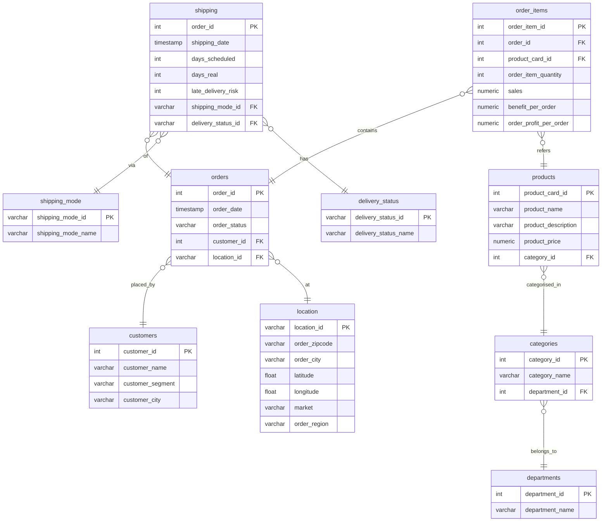

# DataCo Supply Chain Analytics Pipeline

[](#quickstart)
[](#orchestration--validation)
[](#transform-models-dbt)
[](#data-quality--great-expectations)
[](#bi--analytics)

> **Demo/Slide video:** [https://www.youtube.com/watch?v=dO6Y7ipzRO0](https://www.youtube.com/watch?v=dO6Y7ipzRO0)
> **Dataset:** DataCo SMART SUPPLY CHAIN FOR BIG DATA ANALYSIS — [https://www.kaggle.com/datasets/shashwatwork/dataco-smart-supply-chain-for-big-data-analysis](https://www.kaggle.com/datasets/shashwatwork/dataco-smart-supply-chain-for-big-data-analysis)

---

## Table of Contents

* [Project Overview (TH)](#project-overview-th)
* [Architecture](#architecture)
* [SLA / Schedule](#sla--schedule)
* [KPIs](#kpis)
* [Core Database Schema (3NF)](#core-database-schema-3nf)
* [Data Mart Schemas (Star)](#data-mart-schemas-star)
* [Quickstart](#quickstart)
* [Orchestration & Validation](#orchestration--validation)
* [Transform Models (dbt)](#transform-models-dbt)
* [Data Quality (Great Expectations)](#data-quality--great-expectations)
* [BI & Analytics](#bi--analytics)
* [Repository Structure](#repository-structure)
* [Roadmap](#roadmap)

---

## Project Overview (TH)

### 1) บริบทธุรกิจ (Business Context)

* **อุตสาหกรรม:** ค้าปลีก/E‑commerce แบบ Global
* **ตลาดหลัก:** USCA, LATAM, Europe, Pacific Asia, Africa
* **ลูกค้า:** Consumer, Corporate, Home Office
* **กระบวนการหลัก:** Order → Payment → Fraud Detection → Shipping
* **ความท้าทาย:** ส่งมอบตรงเวลา (Late_delivery_risk) และรักษากำไรต่อออเดอร์

### 2) เป้าหมายทีม Data (Data Team Goals)

* สร้าง **Single Source of Truth (SSOT)** ผ่าน DWH (Core 3NF)
* สนับสนุน **Logistics**: Dashboard OTD/สาเหตุความล่าช้า
* สนับสนุน **Sales & Finance**: Sales/Profit Drill‑down ตามภูมิภาค/สินค้า/เซ็กเมนต์
* สนับสนุน **Marketing**: วิเคราะห์พฤติกรรมลูกค้า/ผลของส่วนลด
* สนับสนุน **Risk**: แจ้งเตือน/แดชบอร์ด **SUSPECTED_FRAUD**

### 3) SLA / Schedule

* ข้อมูลพร้อมใช้งาน **ก่อน 08:00** ทุกเช้า
* **Transform + Validate + Publish** ทุก **1 ชั่วโมง**
* แจ้งเตือนทีม Data/BI ผ่าน Email เมื่อเสร็จสิ้นหรือเกิดขัดข้อง

### 4) KPI (ดัชนีชี้วัด)

**Logistics**

* **On‑Time Delivery (OTD) Rate** = % ออเดอร์ที่ *Shipping on time*
* **Late Delivery Rate** = % ออเดอร์ที่ *Late_delivery_risk = 1*
* **Shipping Days Variance** = Real Days − Scheduled Days

**Sales & Profit**

* **Total Sales**, **Total Profit**, **Profit Margin %**, **Average Order Value (AOV)**

**Customer**

* **Sales by Customer Segment**

**Risk**

* **Fraud Rate** = % ออเดอร์ที่ *SUSPECTED_FRAUD*
* **Value at Risk (VaR)** = มูลค่ารวมของออเดอร์ที่ *SUSPECTED_FRAUD*

---

## Architecture

**Ingestion** (CSV → Postgres via Airbyte) → **Transform** (dbt: Core 3NF → Marts Star) → **Quality** (Great Expectations) → **Orchestration** (Airflow DAG) → **BI** (Metabase)

```
CSV (Kaggle)
   │
   ▼
Airbyte  ─────►  Postgres (staging)
                       │
                       ▼
                 dbt (core 3NF)
                       │
                       ▼
                 dbt (marts Star)
                       │
        ┌──────────────┴──────────────┐
        ▼                             ▼
Great Expectations               Metabase (Dashboards)
        ▲                             ▲
        └────────── Airflow DAG ──────┘
```

---

## SLA / Schedule

* Airflow ตั้ง **hourly** schedule; ขับเคลื่อน ingestion → transforms → tests → publish
* ตรวจความสดใหม่ของตารางสำคัญ (freshness) และแจ้งเตือนเมื่อเกิน SLO

---

## KPIs

ตัวอย่าง metric ที่คำนวณจาก **fct_sales_items** และ **fct_shipping_orders**:

* `otd_rate`, `late_delivery_rate`, `shipping_days_variance`
* `total_sales`, `total_profit`, `profit_margin_pct`, `aov`
* `sales_by_segment`, `fraud_rate`, `var_amount`

---

## Core Database Schema (3NF)

> Transform จาก staging โดยเน้น 1NF/2NF/3NF ตามหลัก Normalization

* **1NF**: คอลัมน์เป็น **Atomic** ไม่มีกลุ่มข้อมูลซ้ำ
* **2NF**: Non‑key ทุกตัว **ขึ้นกับคีย์หลักทั้งหมด**
* **3NF**: ตัด **Transitive Dependencies** โดยแยกเป็นตารางมิติ เช่น `location`, `shipping_mode`, `delivery_status`



**เหตุผลสำคัญของ 3NF (ตัวอย่าง):**

* แยก `location` ออกจาก `orders` เพื่อลด transitive dependency (city → state → market)
* แยก `shipping_mode`, `delivery_status` เป็นตารางอ้างอิง ป้องกันข้อมูลซ้ำ/สะกดไม่ตรง
* ไม่เก็บค่าอนุพันธ์เช่น *Sales per customer* แต่คำนวณแบบ on‑the‑fly

---

## Data Mart Schemas (Star)

> ใช้ตอบ KPI เร็วขึ้นด้วยแฟคต์/ไดเมนชันที่สอดคล้องกัน (Conformed Dimensions)

```mermaid
erDiagram
    dim_date {
        varchar date_key PK
        date full_date
        int year
        int month_number
        varchar month_name
    }
    dim_customer {
        int customer_key PK
        varchar customer_name
        varchar customer_segment
    }
    dim_product {
        int product_key PK
        varchar product_name
        varchar category_name
        varchar department_name
    }
    dim_location {
        varchar location_id PK
        varchar order_city
        varchar market
        float latitude
        float longitude
    }
    dim_orderstatus {
        varchar order_status_key PK
        varchar order_status_name
    }
    dim_shippingmode {
        varchar shipping_mode_id PK
        varchar shipping_mode_name
    }
    dim_deliverystatus {
        varchar delivery_status_id PK
        varchar delivery_status_name
    }

    fct_sales_items {
        int order_item_id PK
        varchar order_date_key FK
        int product_key FK
        int customer_key FK
        varchar location_id FK
        varchar order_status_key FK
        numeric sales
        int order_item_quantity
        numeric benefit_per_order
    }

    fct_shipping_orders {
        int order_id PK
        varchar order_date_key FK
        varchar shipping_date_key FK
        int customer_key FK
        varchar location_id FK
        varchar order_status_key FK
        varchar shipping_mode_id FK
        varchar delivery_status_id FK
        int days_scheduled
        int days_real
        int late_delivery_risk
    }

    fct_sales_items }o--|| dim_date : on
    fct_sales_items }o--|| dim_product : of
    fct_sales_items }o--|| dim_customer : by
    fct_sales_items }o--|| dim_location : at
    fct_sales_items }o--|| dim_orderstatus : status

    fct_shipping_orders }o--|| dim_date : ordered_on
    fct_shipping_orders }o..|| dim_date : shipped_on
    fct_shipping_orders }o--|| dim_customer : for
    fct_shipping_orders }o--|| dim_location : to
    fct_shipping_orders }o--|| dim_orderstatus : status
    fct_shipping_orders }o--|| dim_shippingmode : via
    fct_shipping_orders }o--|| dim_deliverystatus : delivery_status
```

---

## Quickstart

> ต้องการ: **Docker** และ Docker Compose

```bash
# 1) clone repo
git clone https://github.com/Dxrksvng/Pj-Data-Pipeline.git
cd Pj-Data-Pipeline

# 2) (ถ้ามีไฟล์ .env ใน /airbyte ให้ตรวจค่าพอร์ต/รหัสผ่าน)

# 3) start all services
docker compose up -d

# 4) URLs (ค่าเริ่มต้นทั่วไป)
# Airbyte:   http://localhost:8000
# Airflow:   http://localhost:8080  (user/pass ตั้งใน docker-compose หรือ env)
# Metabase:  http://localhost:3000
# Postgres:  localhost:5432

# 5) หยุดระบบ
docker compose down
```

> ใส่ไฟล์ CSV ที่ `airflow/dags/data/DataCoSupplyChainDataset.csv` (มีตัวอย่างใน repo) แล้วตั้งค่า connection ให้ Airbyte ดึง/โหลดเข้าสู่ Postgres (staging)

---

## Orchestration & Validation

* **Airflow DAG**: `dataco_supply_chain_pipeline`
  เฟสงาน: *ingest_csv* → *fix_staging_types* → *dbt_deps_* → *dbt_run_core* → *dbt_run_mart* → *dbt_test_* → *gx_validate_*
* ตั้ง schedule เป็น hourly + อีเมลแจ้งเตือนเมื่อสำเร็จ/ล้มเหลว

---

## Transform Models (dbt)

* โปรเจ็กต์: `dbt/supply_chain_core`, `dbt/supply_chain_mart`
* Core: แบบ **3NF** แยก `orders`, `order_items`, `customers`, `products`, `location`, `shipping`
* Marts: **Star** — `fct_sales_items`, `fct_shipping_orders` + มิติร่วม (conformed)

รันตัวอย่าง:

```bash
docker compose exec airflow-webserver bash -lc "dbt deps --project-dir /opt/dbt/supply_chain_core && dbt run --project-dir /opt/dbt/supply_chain_core && dbt test --project-dir /opt/dbt/supply_chain_core"
```

---

## Data Quality (Great Expectations)

* โฟลเดอร์: `gx/` และ `gx_scripts/`
* ตรวจ schema/values/row count บน staging/core/mart
* ตัวอย่างสคริปต์: `create_supply_chain_expectations.py`, `create_supply_chain_checkpoint.py`

รันตัวอย่าง:

```bash
docker compose exec gx bash -lc "python /app/gx_scripts/create_supply_chain_expectations.py && python /app/gx_scripts/create_supply_chain_checkpoint.py"
```

---

## BI & Analytics

* **Metabase** เชื่อม Postgres (core/marts) เพื่อสร้าง Dashboard:

  * Logistics: OTD, Late Delivery, Variance
  * Sales & Profit: Sales, Profit, Margin, AOV
  * Risk: Fraud Rate, VaR

---

## Repository Structure

```
.
├── DataCoSupplyChainDataset.csv
├── README.md
├── docker-compose.yml
├── dockerfile.airflow
├── dockerfile.gx
├── airbyte/
├── airflow/
│   └── dags/
│       ├── DataCo_pipeline_DAG.py
│       └── data/DataCoSupplyChainDataset.csv
├── dbt/
│   ├── supply_chain_core/
│   └── supply_chain_mart/
├── gx/
└── gx_scripts/
```

> **หมายเหตุ:** ไฟล์ log/`__pycache__` ควรถูก ignore ผ่าน `.gitignore`

---

## Roadmap

* เพิ่ม Freshness Tests (dbt source freshness)
* เพิ่ม Data Contracts / Semantic Layer
* เพิ่ม Alerts ไปยัง Slack/Email สำหรับ late runs หรือ quality fail
* เพิ่ม Dashboard ตัวอย่าง (Metabase exports)

---

### Credits

* Dataset: Shashwat “DataCo SMART SUPPLY CHAIN for Big Data Analysis” (Kaggle)
* Tools: Airbyte, Apache Airflow, dbt, Great Expectations, Metabase
